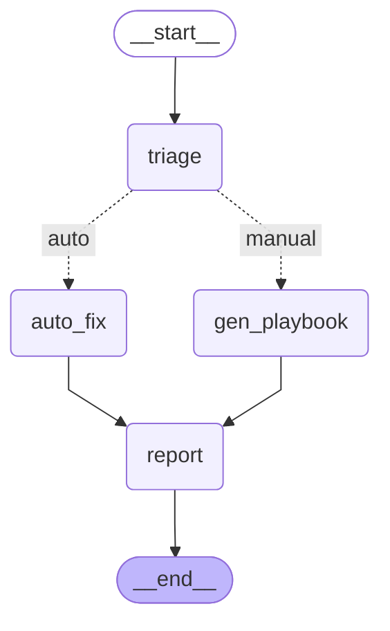

# Ulinzi

A multi-agent SRE incident responder built with LangGraph, Ollama, and Prometheus. Monitors a Linux/Docker stack, classifies incidents with a local LLM, executes safe runbooks automatically, and routes high-severity incidents to a human-in-the-loop approval flow.


---

## An incident, from detection to notification

*The following output is synthetic, representative of a real run against the Odin homelab stack. It will be replaced with live output once Phase 4 (ReporterAgent) is complete.*

**Alert fired**

```
alert:    ContainerRestartLoop
source:   prometheus (cAdvisor)
payload:  increase(container_restart_count[15m]) = 4
fired at: 2026-05-26T08:14:32+00:00
```

**TriageAgent** classified the incident using `qwen2.5:1.5b` via Ollama and instructor:

```json
{
  "severity": "medium",
  "probable_cause": "Loki container restarting due to sustained memory pressure from log ingestion volume.",
  "affected_services": ["loki-loki-1"],
  "confidence": 0.82
}
```

**RemediationAgent** looked up the runbook registry and executed automatically:

```
runbook:  restart_container
target:   loki-loki-1
result:   Restarted container: loki-loki-1
```

**ReporterAgent** pushed to three sinks:

```
ntfy:    pushed to odin-alerts      [08:14:39 +00:00]
Loki:    incident log written       [job=sre-agent, severity=medium]
Grafana: annotation posted          [id=142]
```

Total time from alert to notification: **7 seconds.**

For high and critical severity incidents, the graph pauses at a human approval step before any action is taken. The operator receives the LLM-generated playbook via ntfy and resumes or rejects the run from the command line.

---

## What it is

Ulinzi polls a Prometheus instance across four async loops (host health, containers, observability stack, services), classifies any threshold crossing using a local LLM with structured output validation, and routes the incident through a LangGraph state machine. Low and medium severity incidents execute a runbook automatically. High and critical incidents generate a step-by-step playbook and wait for human approval before proceeding.

Small models are the deliberate default. The primary model (`qwen2.5:1.5b`) uses approximately 1.8 GB of RAM. The fallback (`phi3.5:mini`) loads only when classification confidence falls below 0.6. Both run locally via Ollama with no external API calls, no per-token cost, and no data leaving the machine.

For teams with access to larger models or cloud inference, the model layer is configurable. Any Ollama-compatible model works as a drop-in replacement via two config fields (`PRIMARY_MODEL`, `FALLBACK_MODEL`). The architecture is designed to support a BYOM (Bring Your Own Model) configuration, whether that is a self-hosted Llama or Mistral instance, or a cloud provider like Groq or OpenAI.

Ulinzi is also the core prototype for **Linzi AI**, an agentic SRE platform targeting SMBs in Kenya and East Africa. The delta between this prototype and a multi-tenant SaaS product is a configuration layer and a REST API wrapper. The agentic logic does not change.

---

## Architecture



| Agent | Responsibility | Uses LLM |
|---|---|---|
| MonitorAgent | Polls Prometheus and Loki across 4 async loops | No |
| TriageAgent | Classifies severity, probable cause, affected services | Yes (qwen2.5:1.5b) |
| RemediationAgent | Executes runbook or generates playbook with human approval | Yes (playbook path only) |
| ReporterAgent | Pushes to ntfy, Loki, and Grafana annotations | No |

---

## Prerequisites

- Python 3.12+
- [Ollama](https://ollama.com) running locally with both models pulled:
  ```
  ollama pull qwen2.5:1.5b
  ollama pull phi3.5:mini
  ```
- A Prometheus instance with Node Exporter and cAdvisor scrape targets
- A Loki instance (optional, for log-based alerts)
- An ntfy instance (optional, for mobile notifications)

---

## Installation

```bash
git clone https://github.com/bruceowenga/ulinzi-sre-agent
cd ulinzi-sre-agent
python3 -m venv .venv
source .venv/bin/activate
pip install -e ".[dev]"
cp .env.example .env
# Edit .env with your endpoints and tokens
```

---

## Configuration

All configuration is loaded from `.env`. See `.env.example` for the full list. Key variables:

| Variable | Default | Description |
|---|---|---|
| `PROMETHEUS_URL` | `http://localhost:9090` | Prometheus query endpoint |
| `LOKI_URL` | `http://localhost:3100` | Loki push and query endpoint |
| `GRAFANA_URL` | `http://localhost:3000` | Grafana instance for annotations |
| `GRAFANA_API_KEY` | (required) | Grafana service account token |
| `NTFY_URL` | `http://localhost:8070` | ntfy server URL |
| `NTFY_TOKEN` | (required) | ntfy access token |
| `NTFY_TOPIC` | `odin-alerts` | ntfy topic name |
| `PRIMARY_MODEL` | `qwen2.5:1.5b` | Ollama model for triage |
| `FALLBACK_MODEL` | `phi3.5:mini` | Fallback model when confidence < 0.6 |
| `CONFIDENCE_THRESHOLD` | `0.6` | Threshold below which fallback model is used |
| `DRY_RUN` | `false` | Set to `true` to log runbook actions without executing |

---

## Running

```bash
# Dry run: polling and triage work, runbooks log actions but do not execute
DRY_RUN=true python main.py

# Live
python main.py
```

The process opens `incidents.db` (SQLite) on startup. In-flight incidents, including those paused at the human approval step, survive restarts.

---

## Tests

```bash
pytest -v
```

35 tests covering MonitorAgent deduplication and polling logic, TriageResult schema validation and fallback behaviour, and runbook dry-run correctness. All HTTP calls to Prometheus and Ollama are mocked.

---

## Project structure

```
ulinzi/
├── agents/
│   ├── monitor.py       # Prometheus + Loki polling, 4 async loops
│   ├── triage.py        # instructor + Ollama classification
│   └── remediation.py   # runbook dispatch + playbook generation + interrupt
├── runbooks/
│   ├── __init__.py      # registry mapping alert names to callables
│   ├── container_oom.py # docker restart
│   ├── disk_pressure.py # docker system prune
│   └── log_flood.py     # container log truncation
├── prompts/
│   ├── triage.txt       # system prompt for TriageAgent
│   └── playbook.txt     # system prompt for playbook generation
├── tests/
├── state.py             # IncidentState TypedDict (shared graph state)
├── config.py            # pydantic-settings config loaded from .env
├── graph.py             # LangGraph state machine
├── main.py              # entry point
└── .env.example
```

---

## Path to Linzi AI

The agentic core (all four agents) does not change between prototype and product. Only the delivery layer changes.

| Component | This prototype | Linzi AI v1 |
|---|---|---|
| Config | `.env` per server | Multi-tenant database row per customer |
| Prometheus source | Hardcoded Odin endpoint | Customer-supplied endpoint |
| Entry point | Polling loop in `main.py` | REST API: `POST /incidents/ingest` |
| LLM | Local Ollama | Groq free tier (Llama 3.1 70B) |
| Notifications | Personal ntfy topic | Configurable: Slack, PagerDuty, WhatsApp Business |
| Runbooks | Python functions | YAML-defined marketplace with approval policies |

East Africa market constraints built in from day one: offline-tolerant incident buffering via SQLite, WhatsApp Business API as a notification sink, near-zero inference cost using Groq rather than OpenAI.

---

## License

MIT
